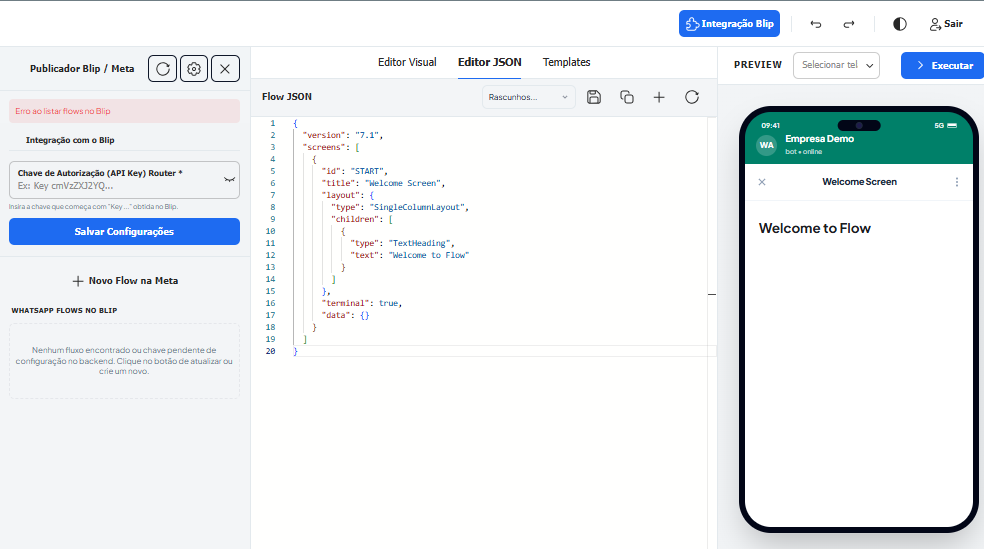
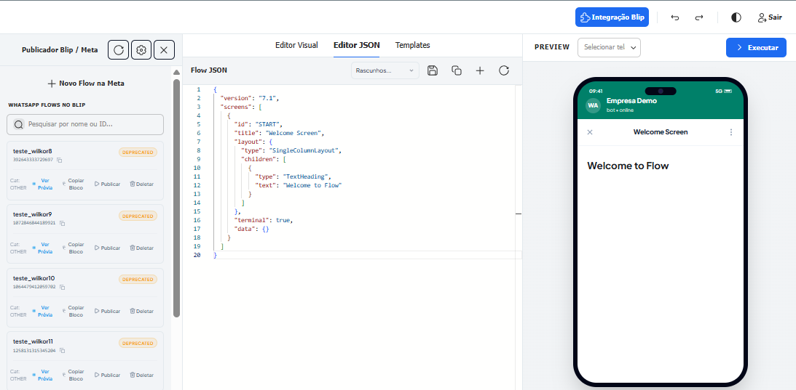
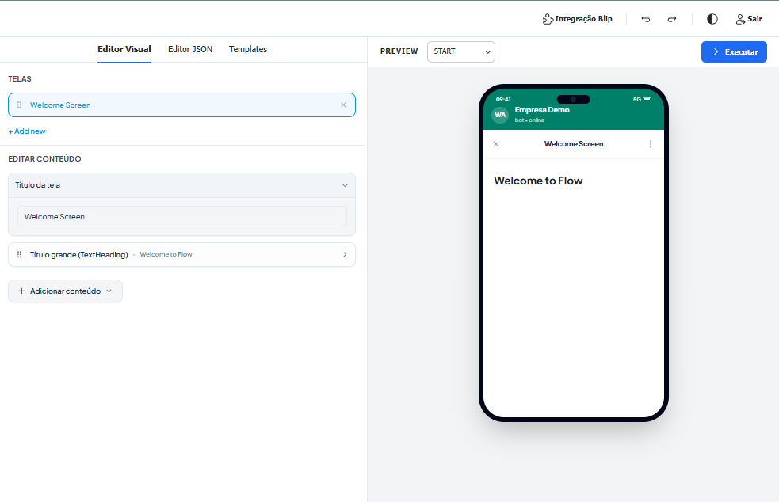
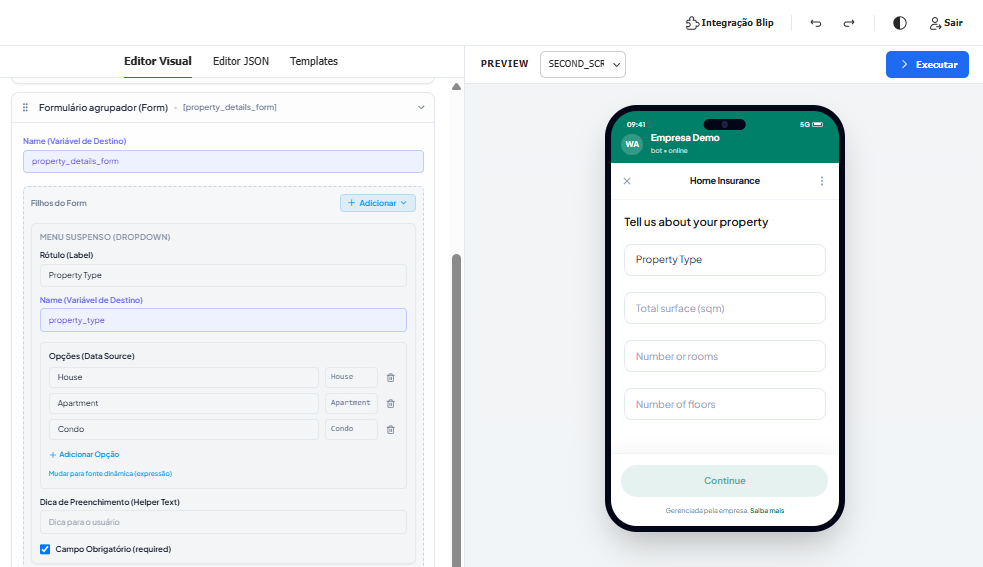
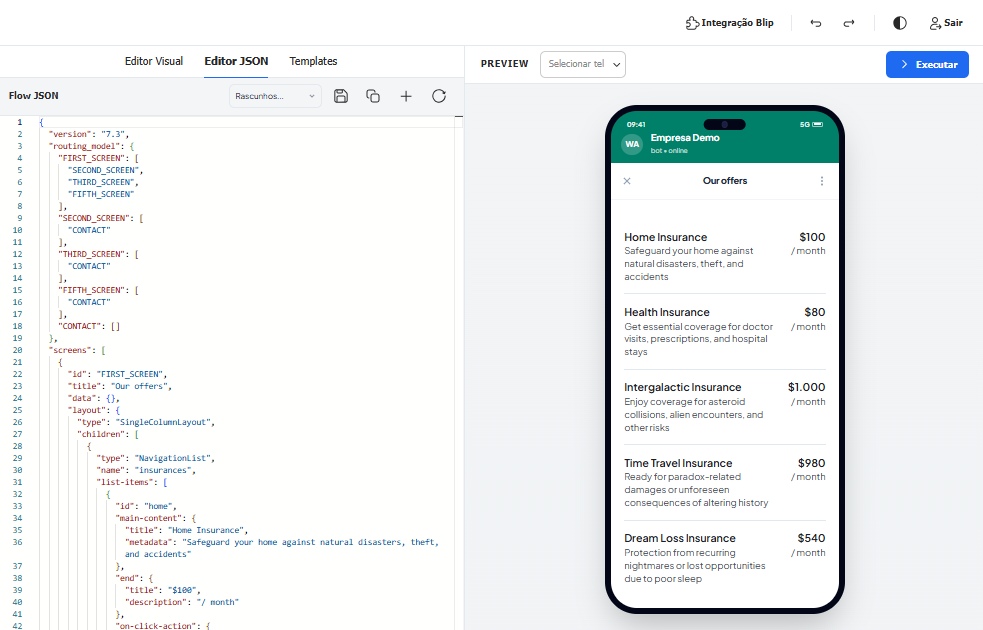
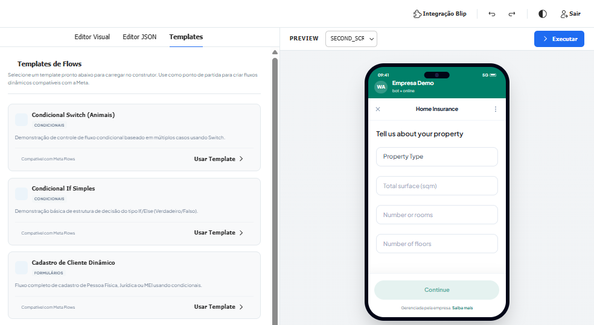
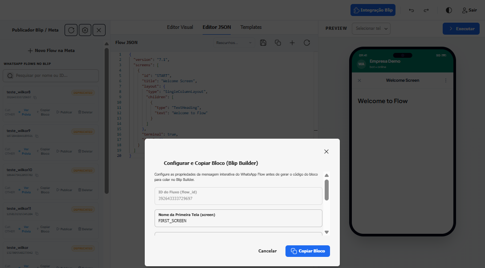

# Como criar e simular WhatsApp Flows no Blip com Flows Playground

O **Flows Playground** acelera o desenvolvimento e prototipagem de fluxos interativos do WhatsApp no Blip, oferecendo um editor visual, editor JSON integrado, simulador de smartphone em tempo real e exportação direta de blocos para o Builder.

**Palavras-chave:** WhatsApp Flows, Flows Playground, Simulador WhatsApp, Flow JSON, Blip Builder, Prototipagem de Fluxos

---

### 1. Vídeo demonstrativo
Esta extensão não possui vídeos ainda.

### 2. Introdução
O **Flows Playground** é uma extensão que centraliza a criação, edição e validação visual de formulários e telas interativas do WhatsApp Flows sem a necessidade de sair do portal do Blip ou realizar testes em dispositivos físicos a cada alteração.

### 3. Funcionalidades
O **Flows Playground** oferece as seguintes funcionalidades:

- **Editor Visual e Editor JSON**: Alterne entre a construção visual por componentes e o código JSON direto com validação de esquema.
- **Simulador Realista de Smartphone**: Prévia interativa em tempo real com mockup de celular realista (com notch, relógio e indicadores) para testar a usabilidade do fluxo.
- **Biblioteca de Templates Prontos**: Modelos pré-configurados de fluxos (estruturas condicionais, formulários de cadastro e listas).
- **Gerenciamento de Fluxos no Blip / Meta**: Integração completa para listar, criar, publicar e deletar fluxos na API da Meta.
- **Configurador de Bloco do Blip Builder**: Modal para configurar parâmetros (primeira tela, CTA, corpo de texto e modo) e copiar instantaneamente o JSON do bloco pronto com scripts automáticos.

A extensão **Flows Playground** é suportada nos seguintes canais: **WhatsApp / Blip Store / Blip Builder**.

### 4. Instalação e Configuração
Após ativar a extensão através da Blip Store, ela deve ser instalada no bot desejado.

#### Passo a passo de Instalação e Configuração:
1. Ao lado de Home na tela principal, clique em **Blip Store**, depois no menu lateral, clique em **Extensões**;
2. Procure por **Flows Playground** e clique em **Ativar**;
3. No painel **Integração Blip**, informe a **Chave de Autorização (API Key) Router** e clique em **Salvar Configurações**:

4. Após a autenticação, a listagem dos seus WhatsApp Flows cadastrados na Meta será carregada automaticamente no painel lateral:

### 5. Exemplos de Uso e Recursos

#### 1. Construção Visual e Edição de Conteúdo:
Edite o título de telas, adicione componentes de texto, listas de navegação e formulários dinâmicos visualizando o resultado instantaneamente no smartphone:

#### 2. Edição de Código no Editor JSON:
Para desenvolvedores que preferem controle total do código, utilize o Editor JSON integrado com suporte a rascunhos e atalhos:

#### 3. Carregamento de Templates Prontos:
Acelere a criação utilizando modelos pré-definidos de fluxos condicionais e formulários de cadastro:

#### 4. Exportação do Bloco para o Blip Builder:
Clique em **Copiar Bloco** na listagem do fluxo desejado, defina a tela inicial e os parâmetros no modal e copie o código completo para colar diretamente no Builder:

### 6. Suporte
Em caso de dúvidas ou necessidade de auxílio na configuração do Flows Playground, entre em contato conosco:

- **E-mail**: contato@wconsulting.tech
- **Telefone/WhatsApp**: 1191628-2384
